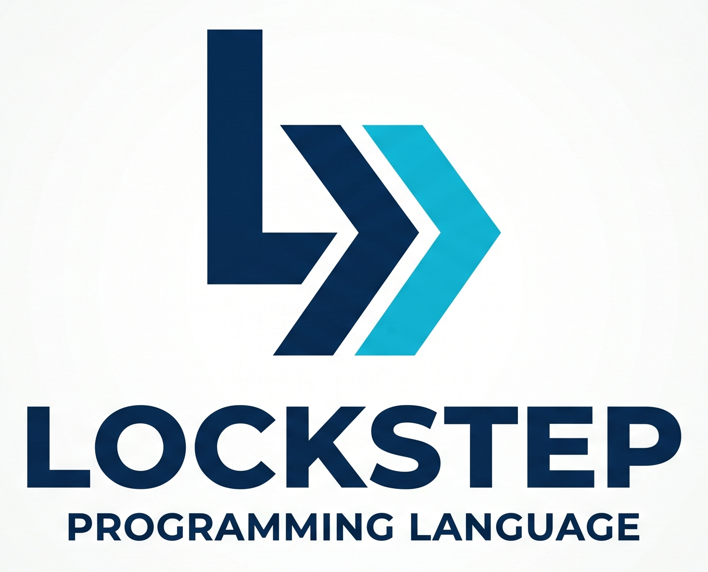

# Lockstep (Shader-C)


**Lockstep** is a data-oriented systems programming language designed for high-throughput, deterministic compute pipelines. It bridges the gap between the productivity of C and the brutal execution efficiency of GPU compute shaders.

By enforcing a strict **Straight-Line SIMD** execution model and **Static Memory Topology**, Lockstep allows the compiler to generate machine code that is mathematically guaranteed to saturate CPU vector units without the overhead of branch misprediction or cache contention.

## 1. Core Philosophy

* **Data-Oriented by Design:** Logic is secondary to data flow. Programs are modeled as physical circuits (pipelines) rather than sequences of instructions.
* **Zero Branching:** Standard control flow (`if`, `for`, `while`) is banned inside compute kernels. Branching is replaced by hardware-native masking and stream-splitting.
* **Predictable Performance:** No `malloc`, no hidden threads, and no garbage collection. Memory is a static arena provided by the Host.
* **Deterministic Parallelism:** Race conditions are impossible by construction. State updates are strictly isolated to `out` streams or linear `accumulator` types.

---

## 2. Language Architecture

### The Pipeline Topology

A Lockstep program is a Directed Acyclic Graph (DAG) of compute nodes.

* **`shader`**: A 1-to-1 mapping. Processes one input element and produces one output element.
* **`filter`**: A 1-to-0/1 mapping. Conditionally passes data to downstream nodes.
* **`pure`**: A side-effect-free mathematical transform. Strictly inlined.
* **`pipeline`**: The "circuit board" that binds streams and uniforms to kernels.

### The Memory Model

Lockstep uses a **Host-Owned Static Arena**. The compiler calculates the exact byte-offset for every Struct-of-Arrays (SoA) member at compile-time.

* **SoA by Default:** Structs are automatically decomposed into parallel primitive arrays to maximize cache line utilization and SIMD width.
* **Saturated Writes:** To eliminate boundary checks, stream indices use saturation arithmetic. If a stream capacity is exceeded, the final element acts as a "trash can," absorbing further writes without memory corruption or branching.

---

## 3. Syntax Guide

### Straight-Line Shaders

Since `if/else` is banned, conditional logic is performed using branchless intrinsics like `step`, `mix`, `clamp`, `min`, `max`, `abs`, `sign`, and `smoothstep`.

```c
shader ApplyPhysics(in Entity ent, out Entity updated, uniform float dt) {
    // Standard math
    float fall_vy = ent.vy - (9.81 * dt);
    float bounce_vy = -ent.vy * 0.8;
    
    // Branchless Branching: step returns 1.0 if ent.y <= 0.0, else 0.0
    float is_grounded = step(0.0, -ent.y);
    
    // mix(a, b, t) acts as a hardware-level selector
    updated.vy = mix(fall_vy, bounce_vy, is_grounded);
    updated.y = max(ent.y + (updated.vy * dt), 0.0);
}

```

### Linear Accumulators

Global reductions (e.g., Total Energy, Max Bounds) are handled via **Linear Types**. Accumulators must be "consumed" by a fold operation, which the compiler lowers into a lock-free parallel reduction tree.

```c
pipeline Simulation {
    stream<Entity, 10000> particles;
    accumulator<float> energy_sum;

    bind {
        particles = Calculate(particles, energy_sum);
        // fold sum consumes the linear type and produces a global scalar
        uniform float total_e = fold sum(energy_sum);
    }
}

```

### Type System (User-Facing Rules)

Lockstep's semantic validator enforces a strict type system with **no implicit coercions**.

#### Primitive types

The currently supported primitive declared types are:

* `int`
* `uint`
* `float`
* `double`
* `bool`
* `string`

`uint` uses unsigned integer semantics in code generation; `double` maps to 64-bit floating point. Unknown declared types still produce `LCK310`.

#### Composite/struct type composition

Struct members may use:

* primitives,
* previously declared struct names, and
* array suffixes (`T[4]`).

The parser and semantic validator also accept generic-wrapper spelling (`Ctor<T>` / `Ctor<T,4>`, including nested forms) so declarations such as `vector<float,4>` can participate in type checking and arena/header layout. In generated LLVM IR, however, generic-wrapper values are currently lowered as opaque pointers rather than first-class aggregate/vector values. Treat generic wrappers as ABI/layout placeholders, not as kernel-value types for arithmetic, field access, or SIMD computation.

Examples that are supported as declared/layout types:

* `Particle[4]`
* `vector<float,4>`
* `matrix<vector<Particle,4>,4>`

Type identity is name-based and exact. Field access chains (`a.b.c`) are valid only when each link resolves to a concrete struct type and an existing field.

#### Type matching and coercion policy

Type checking is strict and explicit:

* No implicit widening or narrowing.
* No implicit `int`⇄`float` promotion.
* Assignment, variable initialization, pure-function arguments, pure-function returns, and bind argument/target checks all require exact type equality.
* Mixed numeric operators (`int` with `float`) without an explicit cast are rejected with `LCK424` (`implicit_numeric_widening`).

When conversion is desired, use an explicit cast.

---

## 4. Compiler & Backend

Lockstep targets **LLVM IR** directly to leverage industrial-grade optimization passes.

* **Single-arena ABI:** Generated kernels receive a `struct Lockstep_Arena*` and compute byte offsets into that arena. The backend does not currently emit blanket `noalias` decorations for arena-derived pointers, so alias-disambiguation-sensitive optimizations should not be assumed from the arena representation alone.
* **SSA locals for concrete values:** Local scalar and concrete-struct values are lowered through SSA-friendly LLVM values where possible; arena loads and stores still use byte-addressed offsets for ABI stability.
* **Manual SIMD lowering:** Stream fusion is vectorized by the backend's fused-vector lowering pass, which strip-mines contiguous stream elements and emits vector loads, stores, arithmetic, and reductions directly. This is separate from relying on LLVM to auto-vectorize scalar loops over the arena.
* **Fast-Math Reductions:** Reduction loops are emitted with `fast` math flags, permitting LLVM to reassociate floating-point operations into horizontal SIMD shuffles.

---

## 5. Host Integration

The compiler generates a C-compatible header for the Host application (C/C++, Rust, or Zig).

1. **Allocate:** Host allocates a `struct Lockstep_Arena` object or a suitably aligned contiguous block of at least `LOCKSTEP_ARENA_BYTES` bytes.
2. **Prime:** Host writes initial data into the SoA fields and byte offsets provided by the header.
3. **Tick:** Host calls `Lockstep_Tick(arena)` with a pointer to that arena. There is no separate `Lockstep_BindMemory` entry point.

See [`examples/`](examples/) for a minimal end-to-end host app in C (`examples/minimal_host.c`) that includes a generated header, allocates arena memory, primes initial data, and calls `Lockstep_Tick`.

---

## 6. Compiler Frontend Usage

Install in editable mode to enable the packaged CLI entrypoint:

```bash
pip install -e .
lockstepc path/to/program.lock
# or read source from stdin
cat path/to/program.lock | lockstepc --dump
# canonical straight-line formatting
lockstepc path/to/program.lock --format
# emit LLVM IR
lockstepc path/to/program.lock --emit-ir
# emit C host header
lockstepc path/to/program.lock --emit-header
# print compiler version
lockstepc --version
```

### Reproducible dependency installs (locked + hashed)

Lockstep now tracks pinned lockfiles generated from `pyproject.toml` using `pip-tools`:

* `requirements.lock` (runtime dependencies)
* `requirements-test.lock` (runtime + `test` optional group)
* `requirements-lsp.lock` (runtime + `lsp` optional group)

Install using hash verification:

```bash
python -m pip install --require-hashes -r requirements.lock
python -m pip install --require-hashes -r requirements-test.lock
python -m pip install --require-hashes -r requirements-lsp.lock
```

Refresh lockfiles after dependency changes:

```bash
python -m pip install --upgrade pip pip-tools
make lock-deps
```

CI enforces lockfile freshness (`make check-lock-deps`) and uses `--require-hashes` during installation so builds fail if hashes do not match.

### Codegen snapshot tests

`tests/test_golden_ir.py` pins the exact LLVM IR and generated C header for a curated corpus (`tests/golden/programs/*.lock`) that exercises the main lowering paths — plain shaders, accumulators with `fold`, filters, and fused accumulator pipelines. Any codegen change that alters the output fails the test with a unified diff, so ABI or lowering changes are reviewed deliberately. The snapshots are deterministic and target-pinned, so they are stable across the CI matrix. When a change is intentional, regenerate and review the diff:

```bash
LOCKSTEP_UPDATE_GOLDEN=1 pytest tests/test_golden_ir.py
# or:
python tests/golden/regenerate.py
```

### Benchmarking and regression checks

Real measured results from every harness below — captured on a documented host — are published in [`benchmarks/RESULTS.md`](benchmarks/RESULTS.md).

Generate benchmark output locally:

```bash
make bench
```

This writes `benchmark-results.json` in the repository root. The CI workflow uploads this file as an artifact for every pull-request benchmark run.

Compare current results against the checked-in baseline with a 10% slowdown threshold:

```bash
make bench-check
```

Baseline files live under `benchmarks/baselines/`. The default CI gate uses `benchmarks/baselines/default.json` and tracks KPI metrics listed in that file's `kpis` array.

To update the baseline:

1. Run `make bench` on a representative machine/state.
2. Review `benchmark-results.json` for outliers.
3. Copy accepted values into `benchmarks/baselines/default.json`.
4. Re-run `make bench-check` and commit both the baseline update and rationale in your PR.

The regression check currently runs in **advisory mode** on pull requests (warning-only via `continue-on-error`). Once enough benchmark history is collected, switch it to required by removing `continue-on-error: true` in `.github/workflows/tests.yml` and enabling branch protection for the benchmark job.
### Benchmarking compiler and simulation latency

Install test dependencies (includes `pytest-benchmark`) and run:

```bash
python -m pip install --require-hashes -r requirements-test.lock
make bench
```

`make bench` executes `pytest tests/benchmarks -q --benchmark-only` and prints a benchmark summary table with per-test timing statistics (for example `min`, `max`, `mean`, and iteration counts). The benchmark suite uses fixed seeds and deterministic row counts (`1k`, `10k`, `100k`) so historical comparisons remain stable across runs.

### Native execution benchmarks (compiled code throughput)

The harnesses above all time the Python frontend (parse + in-Python simulate). To measure the code Lockstep actually ships, `benchmarks/native/` compiles each workload's generated LLVM IR with `clang -O3 -march=native`, links a generated host driver that calls `Lockstep_Tick` in a timed loop over a full arena, and reports real execution throughput:

```bash
make bench-native
# or, directly:
python benchmarks/native/run_native.py
python benchmarks/native/run_native.py --workload particle_energy --iterations 5000 --json
```

Reported metrics are per-tick latency (`per_tick_us`), stream throughput (`mrows_per_sec`), arena bandwidth (`arena_gib_per_sec`), and a deterministic output `checksum`. This requires an LLVM/clang toolchain on `PATH`; the harness exits with a clear message if `clang` is unavailable. See [`benchmarks/native/README.md`](benchmarks/native/README.md) for details. Absolute numbers are host-dependent, so treat them as relative/regression signals.

On pull requests, the `native-benchmark` CI job runs the harness and then gates its **deterministic** invariants — arena ABI (`arena_bytes`, `rows_per_tick`) and output `checksum` — against the checked-in baseline `benchmarks/baselines/native.json` via `make bench-native-check`. These are hardware-independent, so a drift is a real codegen ABI/correctness regression and fails the job (unlike the frontend throughput gate, which is advisory). Throughput is *not* gated — it is host-dependent and too noisy on shared runners — but the full JSON report is uploaded as a CI artifact for trend tracking. When a codegen change intentionally moves the invariants, regenerate the baseline and review the diff:

```bash
python benchmarks/native/run_native.py --output native-results.json
python scripts/check_native_benchmark.py --current native-results.json --update
```

To quantify *why* Lockstep uses a Struct-of-Arrays memory layout, `make bench-soa` (or `python benchmarks/native/soa_vs_aos.py`) runs the same branchless particle kernel over identical data in SoA and Array-of-Structs layouts across a range of sizes and reports the throughput ratio. Both layouts compute identical results, so the difference is purely layout: SoA wins on vectorization (contiguous SIMD loads) and, for kernels that read a subset of fields, on bandwidth.

To measure the throughput lost when a multi-stage pipeline is not fused, `make bench-fusion` (or `python benchmarks/native/fusion_probe.py`) compares the per-stage loops against a single fused loop over the same computation. Codegen now fuses accumulator stages (the `accum` restriction on fusion has been lifted); the remaining case codegen still lowers per stage is a group containing a **filter** — see [`benchmarks/native/README.md`](benchmarks/native/README.md).

Programmatic frontend usage is available from `lockstep_compiler`:

```python
from lockstep_compiler import LockstepCompileResult, compile_lockstep

result: LockstepCompileResult = compile_lockstep(source_code, verbose=True)
```

`compile_lockstep(...)` returns a `LockstepCompileResult` containing:

* `parse_tree`: ANTLR parse tree for the source.
* `entities`: extracted frontend entities (`structs`, `shaders`, `streams`, `accumulators`).
* `diagnostics`: first-class compiler diagnostics (`LockstepDiagnostic`) for non-fatal observations.

### Pipeline Simulation (small datasets)

Use the CLI simulator to validate pipeline wiring/cardinality before LLVM backend generation:

```bash
lockstepc path/to/program.lock --simulate
lockstepc path/to/program.lock --simulate --simulate-input path/to/input.json
```

`--simulate-input` expects JSON with optional `streams` and `accumulators` maps, for example:

```json
{
  "streams": {
    "raw_positions": [{"id": 1}, {"id": 2, "_keep": false}]
  },
  "accumulators": {
    "energy": [0.5, 1.5]
  }
}
```

Simulation output includes per-route `input_count`/`output_count`, updated stream snapshots, accumulator contents, and folded uniform values.

By default, fold reductions (`sum` / `avg`) run in deterministic pure-Python mode, including mixed numeric accumulators (`int`, `float`, `bool`) with stable coercion behavior. Optional LLVM-backed reduction remains available as an opt-in for experimentation/perf checks by setting `LOCKSTEP_SIM_USE_LLVM=1` (or passing `use_llvm_runtime=True` in API calls). If opt-in LLVM execution fails (for example missing `clang`/`lli`), simulation reports an explicit runtime error instead of silently falling back.

Generated C headers include `Lockstep_SaturatedWriteIndex(...)` plus per-stream `LOCKSTEP_CAPACITY_STREAM_<NAME>` macros. Define `LOCKSTEP_DEBUG_SATURATED_WRITES` before including the header to log whenever a saturated write falls back to the final index. Override `LOCKSTEP_SATURATED_WRITE_LOG(...)` to integrate with custom telemetry.

### Diagnostic Shape

Each diagnostic includes:

* `severity` (`"info"`, `"warning"`, or `"error"`)
* `code` (stable diagnostic identifier such as `LCK101`, `LCK201`)
* `message`
* `line`
* `column`
* optional `hint`

### Behavior

* **Non-fatal observations** (for example empty `bind` blocks, duplicate declarations, or unreachable statements after a pure-function return) are returned in `LockstepCompileResult.diagnostics` and compilation still succeeds.
* **Pure function return enforcement** is semantic and strict:
  * `LCK413` (`error`) is emitted when a `pure` function body has no `return` statement.
  * `LCK414` (`warning`) is emitted when a `pure` function body contains multiple `return` statements.
  * `LCK415` (`warning`) is emitted for statements that appear after the first `return` in a `pure` function body.
  * `LCK418` (`error`) is emitted when a pure `return` expression type does not match the declared return type.
* **Type-check mismatches** each have distinct diagnostic codes:
  * `LCK412` (`error`) is emitted for pure-function argument type mismatches.
  * `LCK416` (`error`) is emitted for variable initializer type mismatches during AST semantic validation.
  * `LCK417` (`error`) is emitted for assignment type mismatches during AST semantic validation.
  * `LCK424` (`error`) is emitted when arithmetic mixes `int` and `float` operands without an explicit cast.
* **Fatal parse errors** still raise `LockstepCompileError`.
  * `LockstepCompileError.errors` contains parse diagnostics.
  * `LockstepCompileError.diagnostics` mirrors available pre-failure diagnostic context when parse fails.

---

## 7. Regenerating parser

Run the project-native generator target:

```bash
make generate-parser
```

Generated Python parser files are emitted to `generated/parser/` and committed to source control. CI enforces freshness via `make check-generated-parser`, which regenerates and fails when tracked generated files are stale.

## 8. Language Server Protocol (LSP)

Lockstep now ships an opt-in LSP server so editors can surface compiler diagnostics in real time and provide semantic assistance while authoring pipelines.

```bash
pip install -e .[lsp]
lockstep-lsp
```

Current capabilities:

* **Live diagnostics:** Mirrors compiler parse/semantic diagnostics via `textDocument/publishDiagnostics`.
* **Go to Definition for struct members:** Resolves `foo.bar` member access back to the `struct` field declaration when the variable type can be inferred.
* **Hover type info:** Shows inferred type annotations on variables, struct fields, shader names, and pure function names.
* **Bind-route autocompletion:** Suggests existing `bind` routes and callable shader/pure symbols from the current file.

The server communicates over stdio and is compatible with standard editor LSP client configuration.
